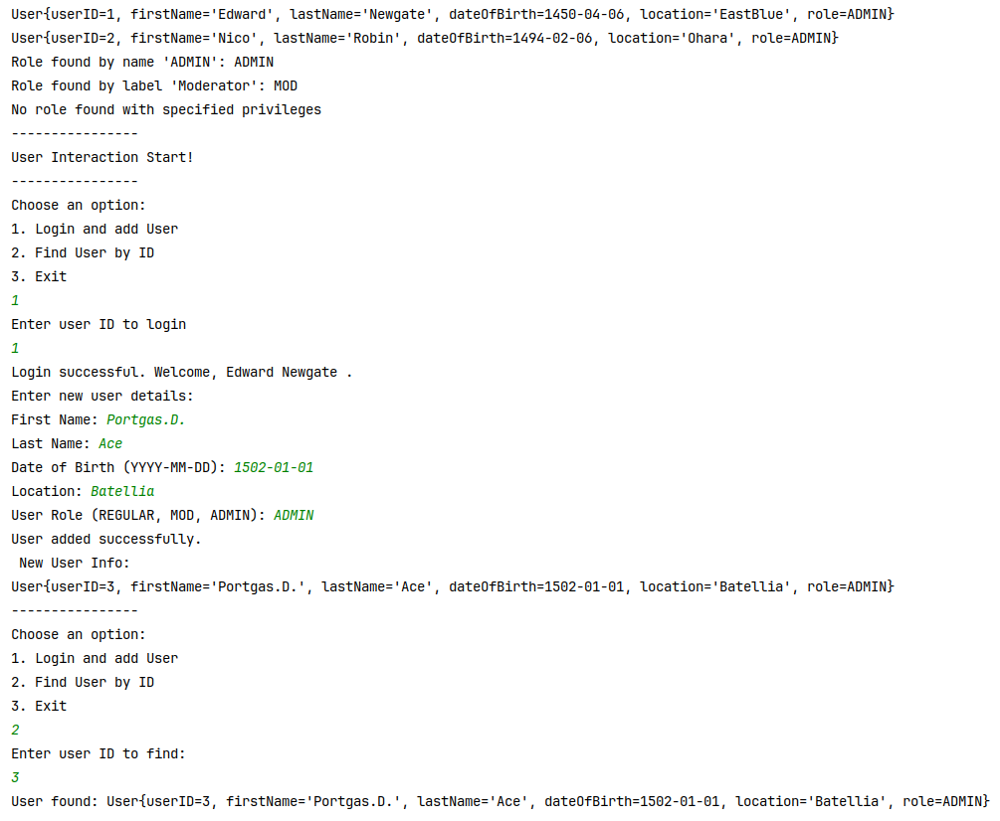
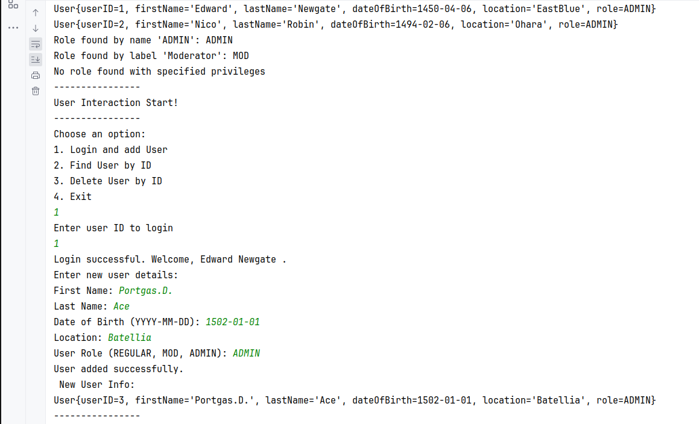
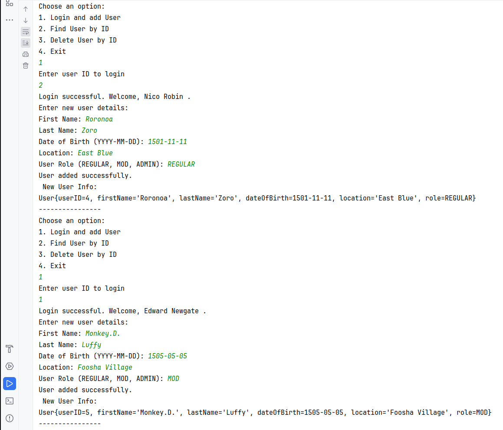
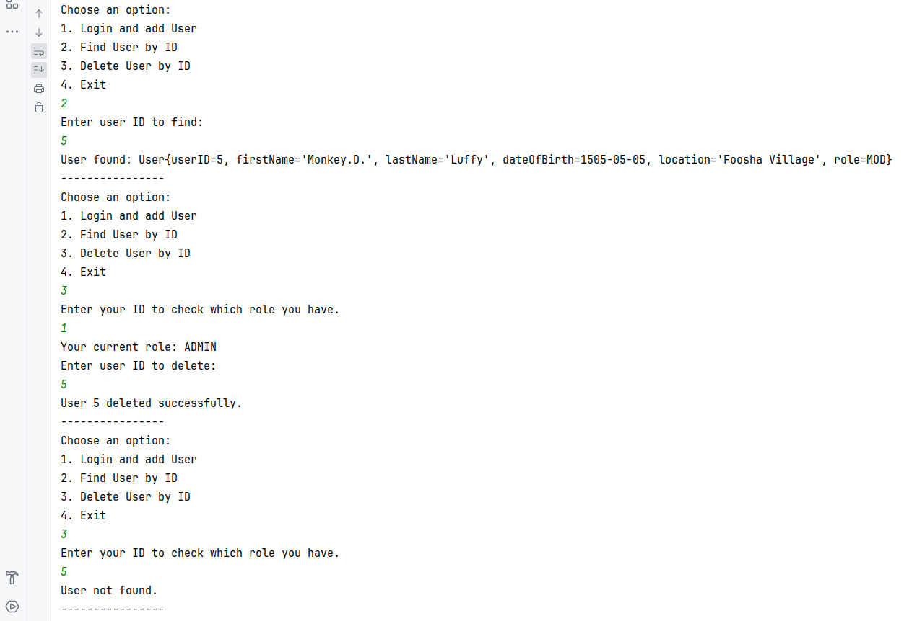
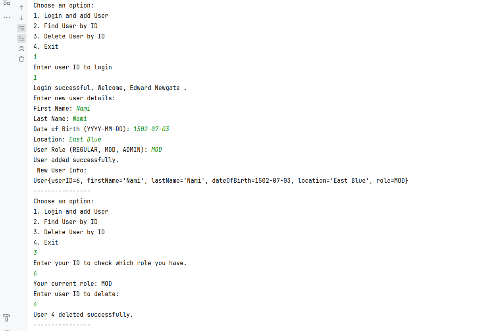

My assignment with Enum in Java online course from (https://github.com/sontyp/j23-e02/tree/main).
The result photos at the end.

---

# User Management System
In this exercise which aims to get more familiar with `Enums` you will be creating a User Management System that allows
to hold user entries with their corresponding data as well as their system privileges for interacting with the system.

## User entries
1. Define a class `User` which holds the following data:
    - ID: Integer
    - firstname: String
    - lastname: String
    - dateOfBirth: Date
    - location: String

   > NOTE: All those fields should be private so that they can't be accessed directly from outside the class.

2. Create a proper _constructor_ that initializes the `User` entry.
3. Define _getter-_ and _setter_ methods to access the data in the entries.
   > NOTE: The ID should be immutable!
4. Override the `toString()` method, so it prints the `User` entry with all its information in a nicely readable way.
5. Create a few sample `User` entries in the _static_ `main(String[] args)` method of the `org.example.Main` class
   and print them to test your implementation.

## User roles (system privileges)
If we want to give users the ability to actively interact with the system, we need to think of security, so _system privileges_
and a _user role system_ become a crucial part of our application.

1. Create an `enum` `UserRole` with the following constants and corresponding values:
    - REGULAR
        - label: String (`"Regular user"`)
        - read: boolean (`true`)
        - writeSelf: boolean (`true`)
        - writeOthers: boolean (`false`)
    - MOD
        - label: String (`"Moderator"`)
        - read: boolean (`true`)
        - writeSelf: boolean (`true`)
        - writeOthers: boolean (`true`)
    - ADMIN
        - label: String (`"Administrator"`)
        - read: boolean (`true`)
        - writeSelf: boolean (`true`)
        - writeOthers: boolean (`true`)

   >    NOTE: The __MOD__ and the __ADMIN__ user roles have the same privileges as it seems, but we're going to implement
   >    a hierarchy later on so that they will actually differ.
2. Go back to the `User` class and add a field `role` of type `UserRole`.
3. Extend your _seeding_ part of sample `User` entries in the `Main` class so that it takes the new field into account and test it properly.
4. Extend the `UserRole` `enum` with the following _static_ methods:
    - `findRoleByName(String name)` it takes a role name (REGULAR, MOD, ADMIN) and returns the corresponding `UserRole` entry.
    - `findRoleByLabel(String label)` it takes a role label (Regular user, Moderator, Administrator) and returns the corresponding `UserRole` entry.
    - `findRolesByPrivileges(boolean read, boolean writeSelf, boolean writeOthers)` it takes booleans for all the different privileges and returns a list of all `UserRole` entries that match all of these privileges -> `findRolesByPrivileges(true, true, true)` returns a list of `{MOD, ADMIN}`.
   > NOTE: Create a proper exception handling in case a role couldn't be found!

## User Management
In order to store users in a structured way you're going to create a `UserTable` class,
where `User` entries are stored as a `Map` in value with their __ID__ as the _key_ in a field `users: Map<Integer, User>`.
> The `users` field must be private and will only be accessible through certain methods of the new class.

Add the following management methods:
- `findUserById(Integer currentUserId, Integer targetUserId)`
- `addUser(Integer currentUserId, User newUser)` - only admins should be able to do so
- `deleteUserById(Integer currentUserId, Integer targetUserId)` - mods can only delete regulars, admins can also delete mods, but not other admins

## BONUS
Find a way to make sure how to edit `User` entries with respect to the privileges.
`UserTable.findUserById(Integer currentUserId, Integer targetUserId)` creates a vulnerability since it provides direct access to the setters of an entry.
Find a way to prevent that.

---

## The result photos

- After adding 'Delete User By Id' option

